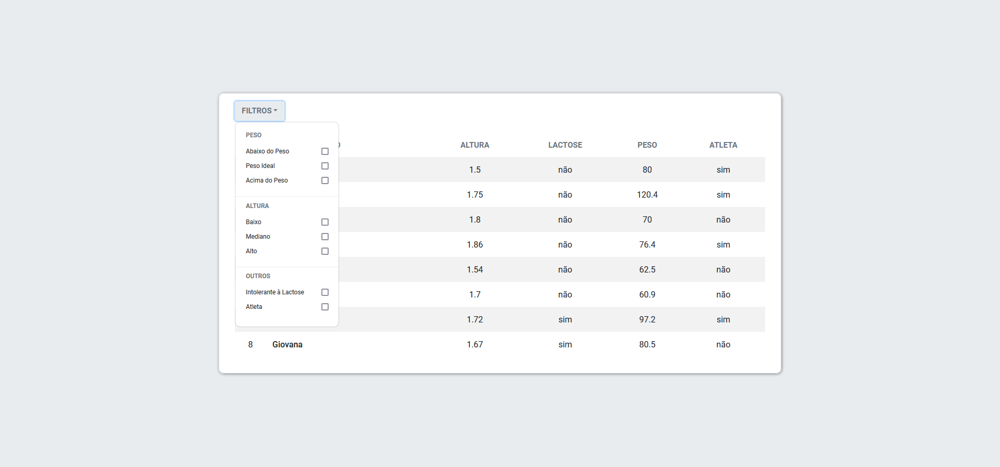

<h1>
    
</h1>

# Desafio Dev Front End Jr Elofy

## Sobre

Projeto de desafio para dev front end junior da Elofy, compondo uma aplicação client-side que consome dados de uma planilha em formato CSV e exibe os dados em uma tabela com a possibilidade de utilização de filtros.

---

<h4 align="center"> 
	🚧  Concluído  🚧
</h4>

---

## Índice

* [Sobre](#sobre)
* [Requisitos](#requisitos)
* [Como Baixar e Iniciar](#como-baixar-e-iniciar)
* [Tecnologias Utilizadas](#tecnologias-utilizadas)
* [Autor](#autor)

---

## Requisitos

- git
- npm
- node.js

---

## Como Baixar e Iniciar

```bash

#Abra o terminal na pasta onde quer clonar o repositório e dê o comando
$ git clone https://github.com/roniets/desafio_elofy

#Em seguida para entrar no diretório execute o comando
$ cd desafio_elofy/desafio_elofy

#Para instalar as dependências necessárias para executar a aplicação execute
$ npm install

#E para iniciar a aplicação dê o comando
$ npm start

```

---

## Tecnologias Utilizadas

O projeto foi desenvolvido utilizando as seguintes tecnologias

- React.js
- React-Bootstrap

---

## Autor

Desenvolvido por Ronie Travassos Silva 🚀
<br>
[](https://www.linkedin.com/in/ronie-travassos-silva-48769b61/) 
